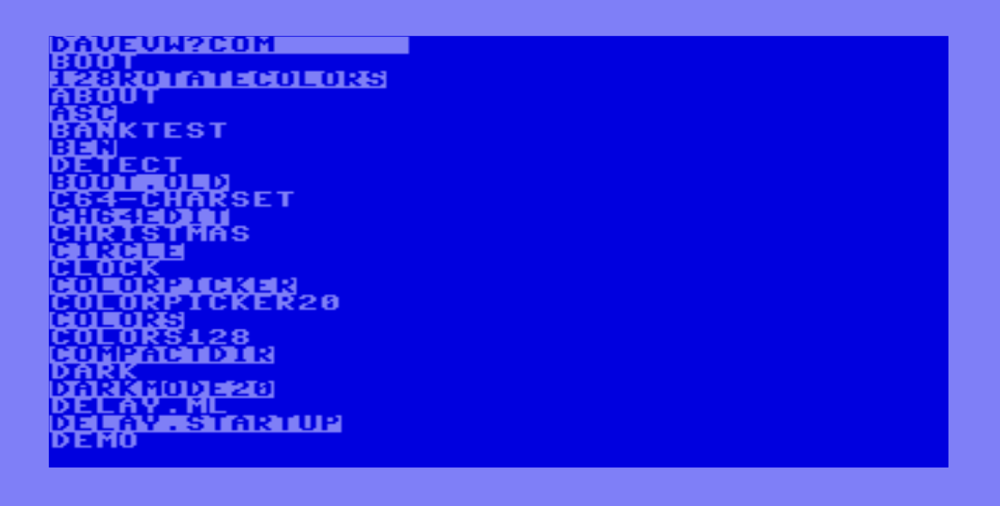

# C64 Strings

Utility program to display strings in BASIC program and/or disk listing

links: 

* strings [blog entry](https://techwithdave.davevw.com/2024/06/strings-or-compact-directory-utility.html)
* strings [source code](https://github.com/davervw/strings/blob/main/strings.asm) at github
* strings [PRG program](https://github.com/davervw/strings/raw/main/build/strings.prg)
* strings [D64 disk image](https://github.com/davervw/strings/raw/main/strings.d64)

strings:

compact:

hint: see comment about nop at label check_newline for changing functionality to compact (check address if source has changed):

    POKE 951, 96